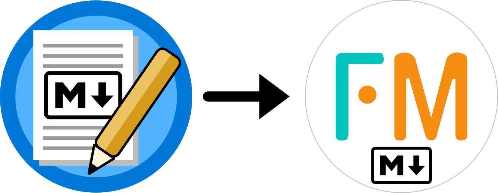

<div align="center">
  
  <h1>FlexiMark Migration Tool</h1>
  <p><strong>Seamless migration from "VSCode Note Taking Extension" to <code>FlexiMark</code></strong></p>
</div>

## ✨ Overview

The **FlexiMark Migration Tool** is a command-line utility that helps you transition your notes from the [VSCode Note Taking Extension](https://marketplace.visualstudio.com/items?itemName=kortina.vscode-markdown-notes) to the [FlexiMark](https://github.com/flexi-mark/fleximark) ecosystem.

It automatically:

* Creates a complete backup of your workspace
* Rewrites Markdown file links
* Relocates embedded resources into a structured `attachments/` folder
* Supports both English and Japanese

### Before

```plaintext
Workspace Root
├── attachments/
│   ├── image0001.png   # used by my_note_01.md
│   ├── image0002.png   # used by my_note_02.md
│   └── image0003.png   # used by my_note_02.md
│
├── Note category 01/
│   └── my_note_01.md
│
└── Note category 02/
    └── Note category 03/
        └── my_note_02.md
```

### After

```plaintext
Workspace Root
├── attachments/
│   ├── Note category 01/
│   │   └── image0001.png
│   │
│   └── Note category 02/
│       └── Note category 03/
│           ├── image0002.png
│           └── image0003.png
│
├── Note category 01/
│   └── my_note_01.md
│
└── Note category 02/
    └── Note category 03/
        └── my_note_02.md
```

## 🚀 Quick Start

### 1. Install `uv`

Follow the installation guide:
👉 [https://docs.astral.sh/uv/#installation](https://docs.astral.sh/uv/#installation)

### 2. Clone this Repository

```bash
git clone https://github.com/your-username/fleximark-migration-tool.git
cd fleximark-migration-tool
```

Or simply [download as ZIP](https://github.com/kashiwade-music/fleximark-migration-tool/archive/refs/heads/main.zip).

### 3. Run the Migration Tool

```bash
uv run ./src/main.py
```

The tool will:

* Ask for your preferred language (`en` or `ja`)
* Prompt you for the absolute path to your old workspace
* Perform backup, link rewriting, and asset relocation

## 🛡️ Safety First

* Non-destructive: Your original workspace is preserved as a timestamped ZIP backup.
* Idempotent: Running it multiple times won’t duplicate assets or overwrite notes unnecessarily.

## 📄 License

MIT License. See [LICENSE](./LICENSE) for more details.
